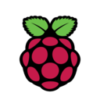

<!--img src="https://raspbernetes.github.io/img/logo.svg" align="left" width="144px"
height="144px"/-->

## rpi-k3s / twojastara

### Home Cloud on Raspberry Pie(s)

 
<!--START_SECTION_PROFILE_VIEWS:readme-info-->

<!--END_SECTION_PROFILE_VIEWS:readme-info-->

* * *

## Workloads

- Apps/Helm Charts:

  - [bitwarden](cluster/cluster/helm/bitwarden) - Passwords Management
  - [cert-exporter](cluster/helm/cert-exporter) - certificates monitoring
  - [event-exporter](cluster/helm/event-exporter) - exports k8s events to loki
  - [gitea](cluster/helm/gitea) - Git with a cup of tea
  - [kanboard](cluster/helm/kanboard) - Kanban project management software
  - [nextcloud](cluster/helm/nextcloud) - personal cloud service
  - [photoprism](cluster/helm/photoprism) - photos management
  - [postgresql](cluster/helm/postgresql) - self explanatory
  - [version-checker](cluster/helm/version-checker) - Checker for newest version of deployed apps
  - [influxdb](cluster/helm/influxdb) - Database for Apple Health exports

- Apps/YAML

  - [unifi](cluster/apps/unifi) - Unifi controller/prometheus poller
  - [www](cluster/apps/www) - Personal website
  - [prometheus stack](cluster/apps/monitoring) - Prometheus/Grafana stack with some additional exporters
  - [media downloads](cluster/apps/media) - jackett, bazarr, radarr, lidarr and sonarr, calibre-web, transmission
  - [gentoo](cluster/apps/gentoo) - cross-compiler and plyground

- System

  - [cert-manager](https://github.com/jetstack/cert-manager) - Automated letsencrypt broker
  - [metallb](cluster/core/networking) - Load-balancer for bare-metal with BGP
  - [longhorn](cluster/helm/longhorn) - longhorn storage
  - [ingress-nginx](cluster/helm/ingress-nginx) - ingress operator
  - [x509-certificate-exporter](cluster/helm/x509-certificate-exporter) - Certs monitoring
  - [node-problem-detector](cluster/helm/node-problem-detector) - Certs monitoring
  - [loki](cluster/helm/loki) - Logs shipper and browser

<!--START_SECTION_LINES_OF_CODE:readme-info-->

<!--END_SECTION_LINES_OF_CODE:readme-info-->

* * *

## :handshake:  Thanks

A lot of inspiration for my cluster came from the people that have shared their
clusters over at [awesome-home-kubernetes].

[awesome-home-kubernetes]: https://github.com/k8s-at-home/awesome-home-kubernetes
